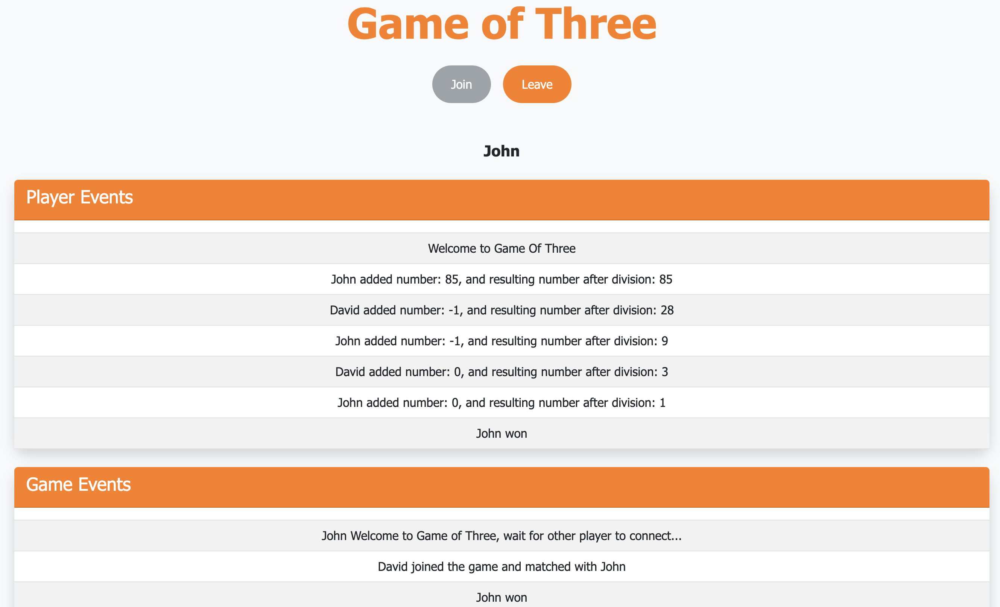

# Game of Three - WebSocket Based Game

## Overview

**Game of Three** is a multiplayer game where two players take turns making moves on a number, aiming to reduce it to 1. Players interact via WebSocket, and the game uses an event-driven architecture to handle game events and communication between players.

### Game Modes:
This application provides two different modes of playing:

- **Manual Mode**: Players are prompted to select from `1`, `-1`, or `0` to adjust the number, ensuring the result is divisible by 3.
- **Automatic Mode**: The application automatically handles the calculations and chooses the optimal adjustment for the player.

### Game Screen


### Key Features:
- **WebSocket Communication**: Real-time interaction between players using the STOMP protocol.
- **Domain-Driven Design (DDD)**: Clear separation of domain models like `Player`, `Game`, `Move`, and `Event`.
- **Event-Driven Architecture**: Events like player registration, move updates, and game status (start, win) are published and consumed asynchronously.
- **Channels for Events**:
    - **Player-Specific Events**:  for events specific to a player's game (e.g., move updates, player actions).
    - **Game-Specific Events**: for broader game events that apply to all players (e.g., game start, player wins, player registration).
---
### Event-Driven Design

In this application, we use **Spring’s `ApplicationEventPublisher`** to manage the publishing and consuming of events, for simplicity and in-memory event handling within the application. 

It can be easily replaced with more advanced messaging platforms like **RabbitMQ**, **Kafka**, or **ActiveMQ** if the system requires higher scalability or distributed event processing. 

---

## How to Run the Application

### Requirements:
 `Java21 and Maven`
  or
`Docker`

### Setup Instructions:

1. **Clone the repository**:
   ```bash
   git clone https://github.com/SupriyaPS24/gameofthree.git

  **Method1: Run with maven**

1. **Build and run the application in application root folder:**:
```bash
   mvn clean install
```

```bash
   mvn spring-boot:run
```

**Method2: Run with Docker**

1. **Build the Docker image:**:

```bash
   docker build -t gameofthree .
```
   
2. **Run the Docker container:**:
```bash
   docker run -p 8080:8080 gameofthree
``` 

**Access the game: Open your browser and navigate to http://localhost:8080 to connect to the game.**:

implemented simple user interface for easier demonstration. Game results can also be viewed on console. 

---
### References: 

1. https://spring.io/guides/gs/messaging-stomp-websocket
2. https://www.javainuse.com/spring/boot-websocket-chat
3. https://umar-fajar14.medium.com/spring-boot-kafka-and-websocket-a-practical-approach-to-real-time-messaging-6169f5995fe1

---
### Future Enhancements

**- Better Exception Handling:**
Implement custom exceptions for cleaner error handling.

**- Profile-Specific Logging:** 
Improve logging configurations for different environments (dev, prod).

**- Local vs Remote Players:** 
Add features to handle local and remote player setups.

**- Event Broker (e.g., RabbitMQ/Kafka):** 
Consider integrating RabbitMQ/Kafka for better event handling scalability.

**- Kubernetes:**
Deploy the Game of Three application on Kubernetes for scalable and reliable gaming with container orchestration.
